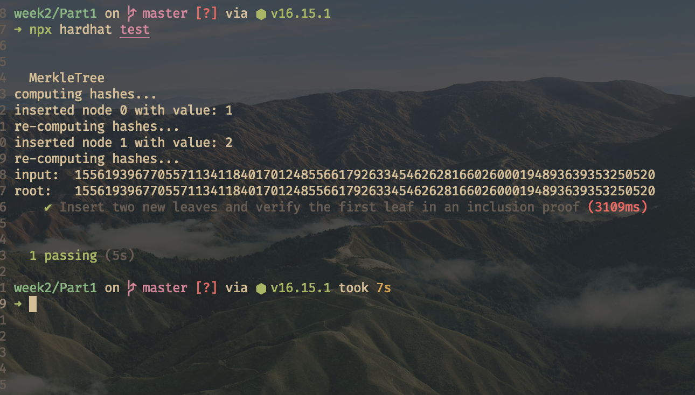
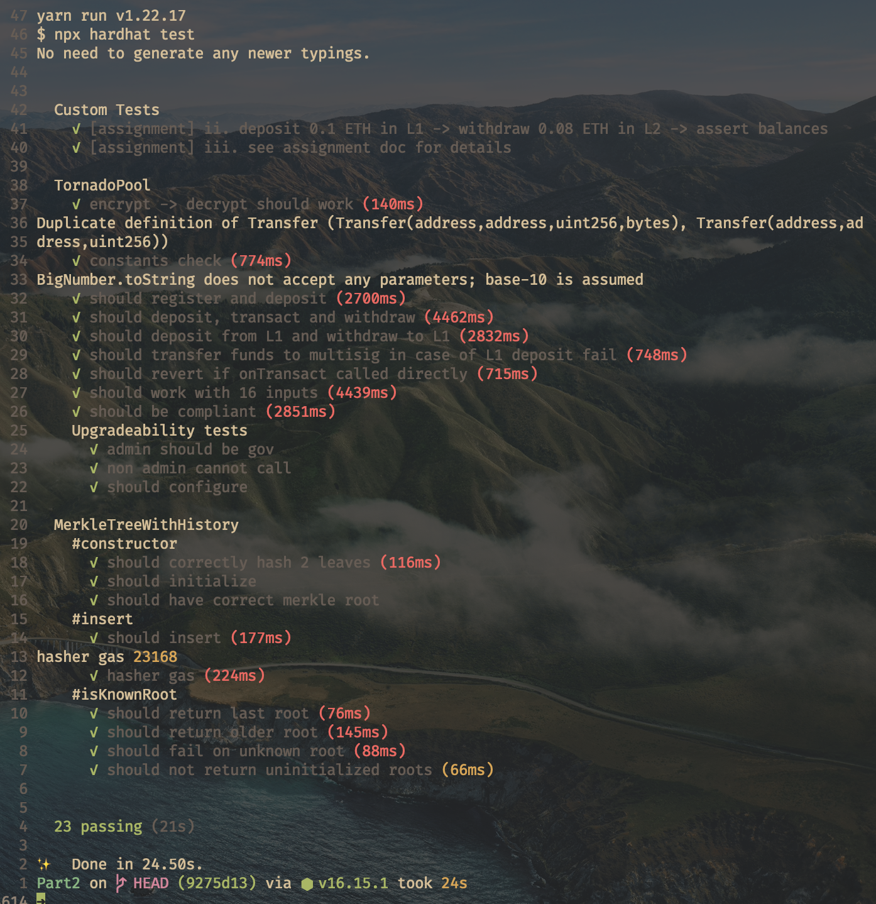

# ZKU week 2 solutions

`siosw#4738 - hi@simonoswald.xyz`

## part 1
**1.** 
**SHA256**
  gas cost: low
  proof generation: slow
  efficiency & proof size: seem to be really fast / small
**MiMC**
  gas cost: around 2x SHA256, higher than Poseidon
  proof generation: turbo PLONK can generate proofs for MiMC very fast
**Poseidon** 
  gas cost: slightly less than MiMC
  proof generation: much faster than SHA256
**Pedersen**
  proof generation: like MiMC PLONK really excells here

**3.4** 

## part 2
**1.** Nova allows users to transfer funds within the privacy pool, allows custom amounts, and reduces gas fees by moving the pool to L2.  

**2.** Relayers pay the gas cost for users when bridging funds from L1 to L2. This is needed because paying for gas from the users wallet would compromise privacy.

**3.1** 

## part 3
**1.** A Semaphore is a means of anonymous signaling. A set of users is approved by a smart contract, now any member of the set can publish and thereby endorse unique strings without revealing their identity. The only public information is that the string was published by some user within the approved set.

**2.** The external nullifier can also be understood as a topic. While users remain anonymous, the semaphore guarantees that every user can only publish a single commitment per topic. To achieve this the hash of a private identity nullifier, the merkle proof of membership, and the external nullifier must match the public nullifier hash. Every nullifier hash can only be published once.

**3.** Claiming airdrops anonymously by publishing a commitment. A whistleblowing mechanism, sources can prove they are reliable without revealing their identity (of course this must be setup beforehand).
